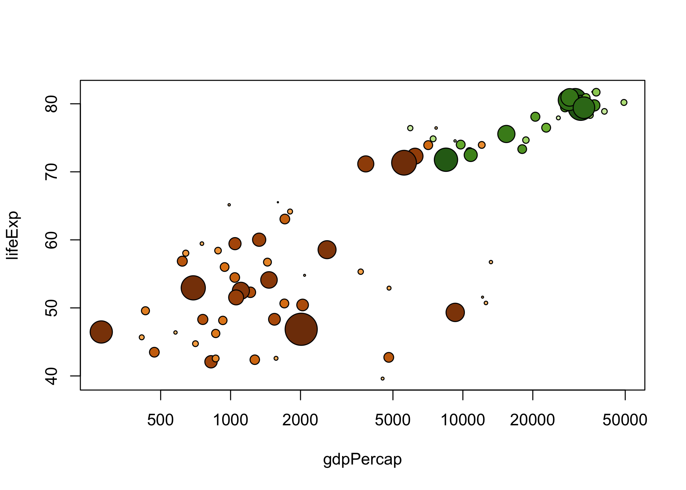
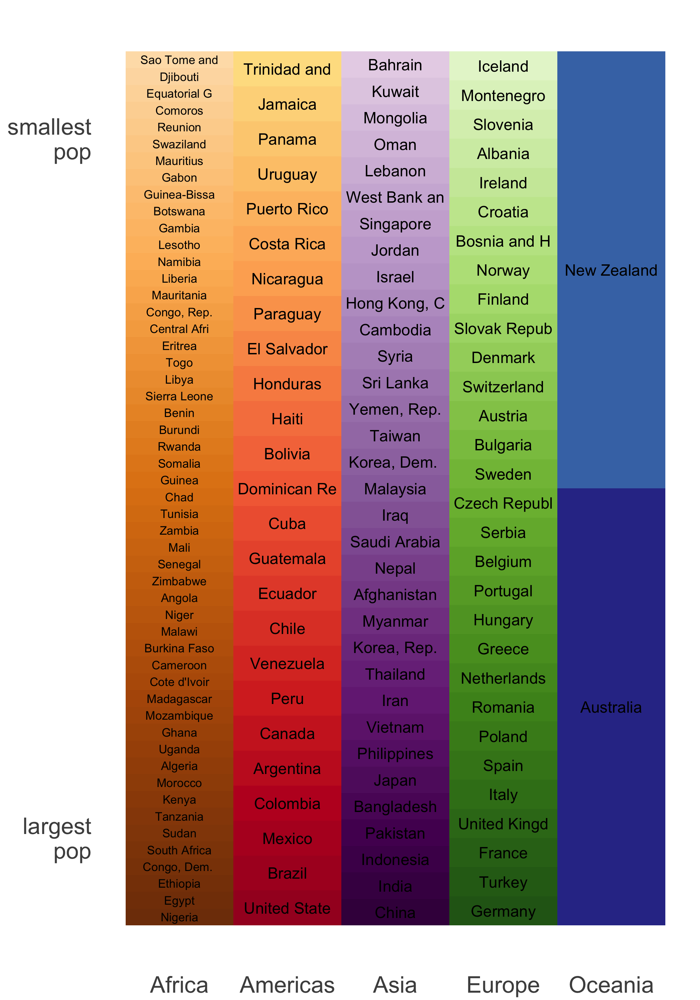

gapminder
=========

Excerpt from the [Gapminder](http://www.gapminder.org/data/) data. This R data package provides the data as a data.frame and in plain text delimited form. Package includes premade color schemes for the countries and continents.

### Install and test drive

Install `gapminder` from CRAN:

``` r
install.packages("gapminder")
```

Or you can install `gapminder` from GitHub:

``` r
devtools::install_github("jennybc/gapminder")
```

Load it and test drive with some data aggregation and plotting:

``` r
library(gapminder)

aggregate(lifeExp ~ continent, gapminder, median)
##   continent lifeExp
## 1    Africa 47.7920
## 2  Americas 67.0480
## 3      Asia 61.7915
## 4    Europe 72.2410
## 5   Oceania 73.6650

suppressPackageStartupMessages(library(dplyr))
gapminder %>%
    filter(year == 2007) %>%
    group_by(continent) %>%
    summarise(lifeExp = median(lifeExp))
## Source: local data frame [5 x 2]
## 
##   continent lifeExp
## 1    Africa 52.9265
## 2  Americas 72.8990
## 3      Asia 72.3960
## 4    Europe 78.6085
## 5   Oceania 80.7195
    
library(ggplot2)
ggplot(gapminder, aes(x = continent, y = lifeExp)) +
  geom_boxplot(outlier.colour = "hotpink") +
  geom_jitter(position = position_jitter(width = 0.1, height = 0), alpha = 1/4)
```


The package also includes two color schemes, `country_colors` and `continent_colors`. See an image of the full scheme at the bottom of this page. Here's how to exploit the country color scheme in your own graphs, using base graphics:

``` r
# using country_colors with base graphics

# for convenience, integrate the country colors into the data.frame
gap_with_colors <-
  data.frame(gapminder,
             cc = I(country_colors[match(gapminder$country,
                                         names(country_colors))]))

# bubble plot, focus just on Africa and Europe in 2007
keepers <- with(gapminder,
                continent %in% c("Africa", "Europe") & year == 2007)
plot(lifeExp ~ gdpPercap, gap_with_colors,
     subset = keepers, log = "x", pch = 21,
     cex = sqrt(gap_with_colors$pop[keepers]/pi)/1500,
     bg = gap_with_colors$cc[keepers])
```



With `ggplot2`, you can use the country colors by providing `country_colors` to `scale_color_manual()` like so:

``` r
... + scale_color_manual(values = country_colors) + ...
```

Here are some `ggplot2` examples:

``` r
library("ggplot2")

# simple line plot for 5 countries
h_countries <- c("Egypt", "Haiti", "Romania", "Thailand", "Venezuela")
h_dat <- droplevels(subset(gapminder, country %in% h_countries))
h_dat$country <- with(h_dat, reorder(country, lifeExp, max))
ggplot(h_dat, aes(x = year, y = lifeExp)) +
  geom_line(aes(color = country)) +
  scale_colour_manual(values = country_colors) +
  guides(color = guide_legend(reverse = TRUE))
```


``` r

ggplot(subset(gapminder, continent != "Oceania"),
       aes(x = year, y = lifeExp, group = country, color = country)) +
  geom_line(lwd = 1, show_guide = FALSE) + facet_wrap(~ continent) +
  scale_color_manual(values = country_colors) +
  theme_bw() + theme(strip.text = element_text(size = rel(1.1)))
```


``` r
  
ggplot(subset(gapminder, year == 2007 & continent != "Oceania"),
       aes(x = gdpPercap, y = lifeExp)) +
       scale_x_log10(limits = c(150, 115000)) + ylim(c(16, 96)) +
       geom_point(aes(size = sqrt(pop/pi)), pch = 21, color = 'grey20',
       show_guide = FALSE) + scale_size_continuous(range=c(1,40)) +
       facet_wrap(~ continent) + coord_fixed(ratio = 1/43) +
       aes(fill = country) + scale_fill_manual(values = country_colors) +
       theme_bw() + theme(strip.text = element_text(size = rel(1.1)))
```


### Description of the dataset

I have used this excerpt in [STAT 545](http://stat545-ubc.github.io) since 2008 and, more recently, in [R-flavored Software Carpentry Workshops](http://jennybc.github.io/2014-05-12-ubc/) and a [`ggplot2` tutorial](https://github.com/jennybc/ggplot2-tutorial). I've been amazed at how useful and durable this dataset is for teaching data analysis with R.

Description:

-   1704 observations; fills a size niche between `iris` (150 rows) and the likes of `diamonds` (54K rows)
-   6 variables
    -   `country` a factor with 142 levels
    -   `continent`, a factor with 5 levels
    -   `year`: going from 1952 to 2007 in increments of 5 years
    -   `pop`: population
    -   `gdpPercap`: GDP per capita
    -   `lifeExp`: life expectancy

There are 12 rows for each country, i.e. complete data for 1952, 1955, ..., 2007.

The two factors provide opportunities to demonstrate factor handling, in aggregation and visualization, for factors with very few and very many levels.

The four quantitative variables are generally quite correlated with each other and these trends have interesting relationships to `country` and `continent`, so you will find that simple plots and aggregations tell a reasonable story and are not completely boring.

Visualization of the temporal trends in life expectancy, by country, is particularly rewarding, since there are several countries with sharp drops due to political upheaval. This then motivates more systematic investigations via data aggregation to proactively identify all countries whose data exhibits certain properties.

### How this sausage was made

<blockquote class="twitter-tweet" lang="en">
<p>
Data cleaning code cannot be clean. It's a sort of sin eater.
</p>
— Stat Fact (@StatFact) <a href="https://twitter.com/StatFact/status/492753200190341120">July 25, 2014</a>
</blockquote>
The [`data-raw`](data-raw) directory contains all of the scripts used to extract the data from the Excel spreadsheets downloaded from [Gapminder](http://www.gapminder.org) in 2008 and 2009. All underlying and intermediate data is there as well, going back to the Excel files themselves.

I explicitly use this package to teach data cleaning, so have refactored my old cleaning code into several scripts and also include compiled Markdown reports *(no Markdown yet; see [iss\#1](https://github.com/jennybc/gapminder/issues/1))*. In hindsight, I wouldn't necessarily clean it the same way again (and I would download more recent data!), but at this point there is great value in reproducing the data I've been using for ~5 years.

### Plain text delimited files

I make available two plain text, tab delimited `.tsv` files:

-   [`gapminder.tsv`](inst/gapminder.tsv): the same dataset available via `library(gapminder); gapminder`. Each of the 142 countries presents complete data for 12 years: 1952, 1957, ..., 2007.
-   [`gapminder-unfiltered.tsv`](inst/gapminder-unfiltered.tsv): the larger dataset that, **when filtered**, yields [`gapminder.tsv`](inst/gapminder.tsv). In this file, I have NOT filtered for the years 1952, 1957, ..., 2007, I retain countries with incomplete data, and I did not impute data for China in 1952.

The main package dataset has 142 \* 12 = 1704 rows, whereas the larger, unfiltered dataset contains 3312 rows, almost twice as much data.

Here in this repo, these delimited files can be found:

-   in the [`inst/`](inst) sub-directory

Once you've installed the `gapminder` package they can be found locally and used like so:

``` r
gap_tsv <- system.file("gapminder.tsv", package = "gapminder")
gap_tsv <- read.delim(gap_tsv)
str(gap_tsv)
## 'data.frame':    1704 obs. of  6 variables:
##  $ country  : Factor w/ 142 levels "Afghanistan",..: 1 1 1 1 1 1 1 1 1 1 ...
##  $ continent: Factor w/ 5 levels "Africa","Americas",..: 3 3 3 3 3 3 3 3 3 3 ...
##  $ year     : int  1952 1957 1962 1967 1972 1977 1982 1987 1992 1997 ...
##  $ lifeExp  : num  28.8 30.3 32 34 36.1 ...
##  $ pop      : num  8425333 9240934 10267083 11537966 13079460 ...
##  $ gdpPercap: num  779 821 853 836 740 ...
gap_tsv %>% # Bhutan did not make the cut because data for only 8 years :(
  filter(country == "Bhutan")
## [1] country   continent year      lifeExp   pop       gdpPercap
## <0 rows> (or 0-length row.names)

gap_bigger_tsv <- system.file("gapminder-unfiltered.tsv", package = "gapminder")
gap_bigger_tsv <- read.delim(gap_bigger_tsv)
str(gap_bigger_tsv)
## 'data.frame':    3312 obs. of  6 variables:
##  $ country  : Factor w/ 187 levels "Afghanistan",..: 1 1 1 1 1 1 1 1 1 1 ...
##  $ continent: Factor w/ 6 levels "Africa","Americas",..: 3 3 3 3 3 3 3 3 3 3 ...
##  $ year     : int  1952 1957 1962 1967 1972 1977 1982 1987 1992 1997 ...
##  $ lifeExp  : num  28.8 30.3 32 34 36.1 ...
##  $ pop      : num  8425333 9240934 10267083 11537966 13079460 ...
##  $ gdpPercap: num  779 821 853 836 740 ...
gap_bigger_tsv %>% # Bhutan IS here though! :)
  filter(country == "Bhutan")
##   country continent year lifeExp     pop gdpPercap
## 1  Bhutan      Asia 1972  41.837 1087991  807.6226
## 2  Bhutan      Asia 1977  44.708 1205659  816.3102
## 3  Bhutan      Asia 1982  47.872 1333704  946.8130
## 4  Bhutan      Asia 1987  50.717 1490857 1494.2901
## 5  Bhutan      Asia 1992  54.471 1673428 1904.1795
## 6  Bhutan      Asia 1997  58.929 1876236 2561.5077
## 7  Bhutan      Asia 2002  63.458 2094176 3256.0193
## 8  Bhutan      Asia 2007  65.625 2327849 4744.6400
```

Color schemes
-------------

Continent specific colors were selected from `RColorBrewer` palettes.

These were then expanded into a larger set of colors to cover all the countries in each continent, where darker colors correspond to countries with a larger population.

The schemes are provided as named character vectors:

``` r
head(country_colors, 4)
##          Nigeria            Egypt         Ethiopia Congo, Dem. Rep. 
##        "#7F3B08"        "#833D07"        "#873F07"        "#8B4107"
head(continent_colors)
##    Africa  Americas      Asia    Europe   Oceania 
## "#7F3B08" "#A50026" "#40004B" "#276419" "#313695"
```

The country scheme is available in this repo as [PNG](data-raw/gapminder-color-scheme-ggplot2.png) and [PDF](data-raw/gapminder-color-scheme-base.pdf).



Gapminder's data is released under the Creative Commons Attribution 3.0 Unported license. See their [terms of use](https://docs.google.com/document/pub?id=1POd-pBMc5vDXAmxrpGjPLaCSDSWuxX6FLQgq5DhlUhM).
