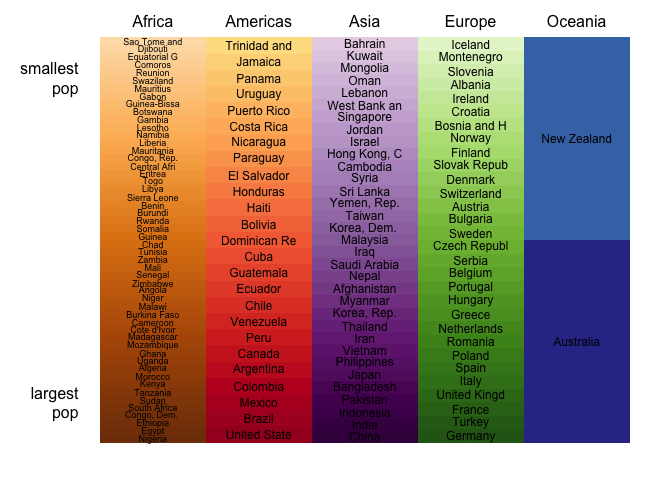
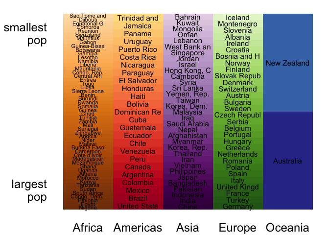

`r format(Sys.Date())`  


```r
library(gapminder)
library(RColorBrewer)
library(plyr)
suppressPackageStartupMessages(library(dplyr))
library(ggplot2)
library(readr)
```

map continent and country into colors
choose a range of colors for each continent


```r
display.brewer.all(type = "div")
```

\ 

```r
color_anchors_by_continent <-
  list(Africa = brewer.pal(n = 11, 'PuOr')[1:5], # orange/brown/gold
       Americas = brewer.pal(n = 11, 'RdYlBu')[1:5],     # red
       Asia = brewer.pal(n = 11, 'PRGn')[1:5],           # purple
       Europe = brewer.pal(n = 11, 'PiYG')[11:7],        # green
       Oceania = brewer.pal(n = 11, 'RdYlBu')[11:10])    # blue

sorted_countries_by_continent <-
  dlply(gapminder, ~ continent, function(x) {
    x <- x %>% droplevels()
    reorder(x$country, x$pop, max) %>% levels() %>% rev()
  })
```

expand anchors into palette that covers all countries in a continent


```r
country_colors_df <-
  mapply(function(anchors, countries) {
    color_fun <- colorRampPalette(anchors)
    data_frame(country = countries,
               color = color_fun(length(countries)))
  },
  color_anchors_by_continent,
  sorted_countries_by_continent,
  SIMPLIFY = FALSE)
country_colors_df <- bind_rows(country_colors_df)
country_colors_df <- country_colors_df %>%
  mutate(continent = gapminder$continent[match(country, gapminder$country)])
country_colors_df %>% str()
```

```
## Classes 'tbl_df', 'tbl' and 'data.frame':	142 obs. of  3 variables:
##  $ country  : chr  "Nigeria" "Egypt" "Ethiopia" "Congo, Dem. Rep." ...
##  $ color    : chr  "#7F3B08" "#833D07" "#873F07" "#8B4107" ...
##  $ continent: Factor w/ 5 levels "Africa","Americas",..: 1 1 1 1 1 1 1 1 1 1 ...
```

color schemes and country count for continents


```r
(continent_colors_df <- country_colors_df %>%
   group_by(continent) %>%
   summarize(n_cty = n_distinct(country),
             color = color[1]))
```

```
## Source: local data frame [5 x 3]
## 
##   continent n_cty   color
##      (fctr) (int)   (chr)
## 1    Africa    52 #7F3B08
## 2  Americas    25 #A50026
## 3      Asia    33 #40004B
## 4    Europe    30 #276419
## 5   Oceania     2 #313695
```

write these to file


```r
write_tsv(country_colors_df, "40_country-colors.tsv")
file.copy(from =  "country-colors.tsv",
          to = file.path("..", "inst", "country-colors.tsv"),
          overwrite = TRUE)
```

```
## [1] FALSE
```

```r
write_tsv(continent_colors_df, "40_continent-colors.tsv")
file.copy(from =  "continent-colors.tsv",
          to = file.path("..", "inst", "continent-colors.tsv"),
          overwrite = TRUE)
```

```
## [1] FALSE
```

convert country and continent colors into named character vectors


```r
country_colors <- country_colors_df$color
names(country_colors) <- country_colors_df$country
continent_colors <- continent_colors_df$color
names(continent_colors) <- continent_colors_df$continent

## save for the package
save(country_colors, file = file.path("..","data", "country_colors.rdata"))
save(continent_colors, file = file.path("..", "data", "continent_colors.rdata"))
```

make a nice figure of my color scheme. try to use as few packages as possible
here so can repurpose as example

prep work


```r
char_limit <- 12  # truncate country names
j_cex <- 4        # cex for ggplot2
y_boundaries <- lapply(continent_colors_df$n_cty, function(x) {
  seq(from = 0, to = 1, length = x + 1)
})
df <- data_frame( # utility data.frame with rectangle boundaries
  xmax = rep(seq_len(length(continent_colors)),
             sapply(y_boundaries, length) - 1),
  xmin = xmax - 1,
  ymin = unlist(lapply(y_boundaries, function(y) head(y, -1))),
  ymax = unlist(lapply(y_boundaries, function(y) y[-1])),
  ymid = (ymin + ymax)/2)
df <- data.frame(df, country_colors_df, cex = j_cex)
df$cex[df$continent == "Africa"] <- j_cex * 0.75
```

base R graphics
control printing of country names


```r
base_cex <- 0.75

op <- par(mar = c(1, 4, 1, 1) + 0.1)
plot(c(0, length(continent_colors)), c(0, 1), type = "n",
     xlab = "", ylab="", xaxt = "n", yaxt = "n", bty = "n")
with(df,
     rect(xleft = xmin,
          ybottom = ymin,
          xright = xmax,
          ytop = ymax,
          col = color, border = NA))
with(df,
     text(x = xmin + 0.5,
          y = ymid,
          labels = substr(country, 1, char_limit),
          cex = base_cex * cex/j_cex))
mtext(continent_colors_df$continent, side = 3,
      line = -0.5, at = seq_len(length(continent_colors)) - 0.5)
mtext(c("smallest\npop", "largest\npop"),
      side = 2, at = c(0.9, 0.1), las = 1)
```

\ 

```r
par(op)

dev.print(pdf,
          "gapminder-color-scheme-base.pdf",
          width = 7, height = 10)
```

```
## quartz_off_screen 
##                 2
```

ggplot2


```r
p <- ggplot(df, aes(xmin = xmin, xmax = xmax, ymin = ymin, ymax = ymax)) +
  geom_rect(fill = df$color) +
  annotate("text",
           x = unclass(df$continent) - 0.5,
           y = df$ymid,
           label = df$country %>% substr(1, char_limit),
           cex = df$cex) + 
  scale_x_continuous(breaks = seq_len(length(continent_colors)) - 0.5,
                     labels = levels(continent_colors_df$continent)) +
  scale_y_continuous(breaks = c(0.9, 0.1),
                     labels = c("smallest\npop", "largest\npop")) +
  theme_bw() +
  theme(panel.grid.major = element_blank(),
        panel.grid.minor = element_blank(),
        panel.border = element_blank(),
        axis.text = element_text(size = rel(1.5)),
        axis.ticks = element_blank(),
        axis.title = element_blank())
p
```

\ 

```r
ggsave("gapminder-color-scheme-ggplot2.png", p, height = 10, width = 7)
```


---
title: "40_make-color-scheme.R"
author: "jenny"
date: "Tue Dec 29 22:58:27 2015"
---
